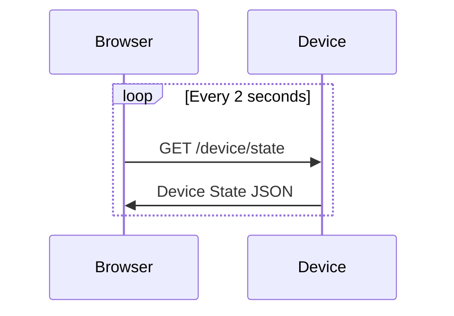
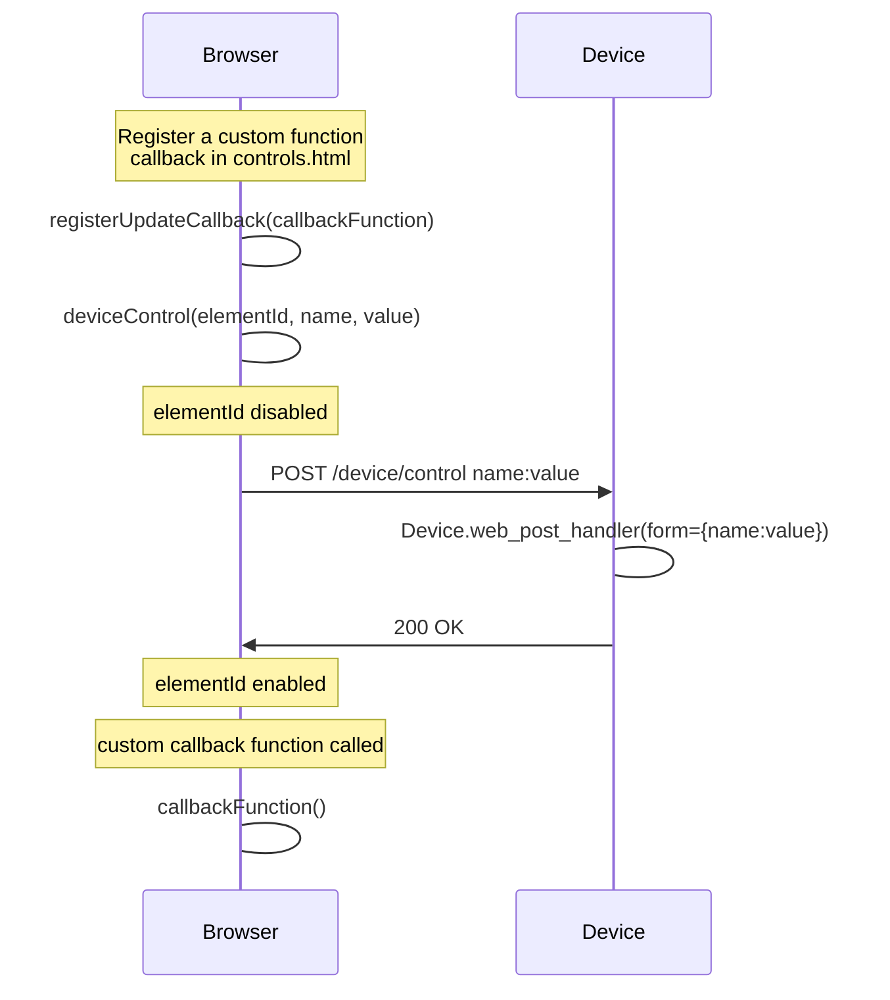

<!--
SPDX-FileCopyrightText: 2023 Charles Crighton <code@crighton.net.nz>

SPDX-License-Identifier: CC-BY-4.0
-->

# Rockwren APIs

Rockwren provides Python and Javascript APIs to support creation of new devices.

- [Web UI API](#web-ui-api)
- [MQTT API](#mqtt-api)

## Web UI API

The Web UI is extended using:

- Extending ```rockwren.Device```:
  - [rocwkren.Device.device_state](#device-state)
  - [rockwren.Device.apply_state](#apply-state)
  - [rockwren.Device.web_post_handler](#web-post-handler)
- Controls.html Templates and Javascript API:
  - [Templates](#templates) using ```rockwren.Device``` class
  - [deviceControl](#devicecontrol)
  - [registerCallbackFunction](#registercallbackfunction)

### Device State

Device state is a JSON representation of the current state of the device.  The default
```rockwren.Device.device_state``` function returns a simple one attribute JSON message with a state attribute set to
either ```ON``` or ```OFF```.

```json
{"state":"ON"}
```

The main page of the device will poll the device state every 2 seconds to update the state display in the browser.



The ```rockwren.Device.device_state(self)``` function is extended to support more complex device capabilities.

#### Device State Examples

The [pico temperature example](/examples/pico_temperature/main.py) is a simple example to provide the
current temperature via the device state:

```python
def device_state(self):
    return ujson.dumps({'temperature': self.temperature})
```

For a RGBW led light strip the device state include multiple attributes:

```python
def device_state(self):

    return ujson.dumps({'state': self.state,
                        'brightness': self.brightness,
                        'color_mode': 'rgbw',
                        'color': {"r": self.rgb_red,
                                  "g": self.rgb_green,
                                  "b": self.rgb_blue,
                                  "w": self.warm_white}
                       })
```

### Apply State

The ```rockwren.Device.apply_state(self)``` function is called after a change is made to the device
state to apply it to the physical device.  It also notifies listeners of the device such as the
MQTT client to send a device status update via MQTT.

When extending ```rockwren.Device.apply_state()```, ```super.apply_state()``` should be called last.

#### Apply State Example

The [pico_led_light](/examples/pico_led_light/main.py) example sets the LED pin:

```python
def apply_state(self):

    if self.state == "ON":
        self.led.on()
    elif self.state == "OFF":
        self.led.off()

    super().apply_state()  # Always call last
```

### Web Post Handler

The ```rockwren.Device.web_post_handler(self, form)``` function is called when a POST request is received from the
web UI.  This function handles web UI device control changes. It is extend or overridden to provide handling for
the device change post requests.



The payload of the POST request is form data.  The ```form``` argument is a dictionary representation of the posted
form data.

```rockwren.Device.web_post_handler``` must return a tuple of JSON response payload and response code. For example:

```python
return self.device_state(), 200
```

The default implementation supports ```state``` and ```toggle```. For example, ```state=ON```, ```state=OFF``` or ```toggle=yes```.  In the case of toggle, the value can be anything and is ignored.

The ```deviceControl``` javascript implementation only supports posting a single input.

#### Web Post Handler Example

The following web post handler sets the state of the device to either ```ON``` or ```OFF```.  It applies the state and
sends the new state of the device ```self.device_state()``` and ```200```.

```python
def web_post_handler(self, form):

    if not form:
        return "Form not provided.", 400
    if form.get("state") and form.get("state").upper() == "ON":
        self.state = "ON"
    elif form.get("state") and form.get("state").upper() == "OFF":
        self.state = "OFF"
    self.apply_state()
    return self.device_state(), 200
```

### Controls.html Templates and Javascript API

Rockwren provides basic control UI out of the box that displays the state of the device (ON or OFF) and provides a
single TOGGLE button to change the state.


There are two parts of this UI control:
- Current state display (ON or OFF)
- An HTML input to control the device (in this case a single button labelled TOGGLE)

This control is provided by a block of html that is included in the rendering of the main web UI page.
The default block is shown below.  To customise the web UI device control an html block must be copied to the root
folder of the device in a file named, by convention, ```controls.html``` with the ```main.py``` script.

The ```self.template``` instance attribute must be set in the ```__init__``` function of the device class to install
the custom control block.

```python
    def __init__(self):
        self.led = Pin("LED", Pin.OUT)
        super().__init__(name="PicoWLED")
        self.template = "/controls.html"  # must be last
```

#### Templates

The ```controls.html``` html block supports [Phew web server template](https://github.com/ccrighton/phew#templates).

The extended ```rockwren.Device``` class can be referenced in the templates with the ```device``` parameter.  Any
functions of the extended class can be accessed.  For example, ```rockwren.Device.is_on()``` function is used in the
html block below:

```html
{{'<h3 id="device-state" style="color:#008000;">ON</h3>' if device.is_on() else '<h3 id="device-state" style="color:#FF0000;">OFF</h3>'}}
```

```device-state``` is supported out-of-the-box and is updated automatically by the web UI.  If it is not needed it
still must be present in the ```controls.html``` but can be hidden:

```html
<h3 hidden id="device-state"></h3>
```

#### deviceControl

Rockwren provides a device control Javascript function.  When an event in the web UI is received for a device update,
such as a button push or slider adjustment, the ```deviceControl(id, attribute, value)``` function must be called.

The ```id``` argument is the element id of the source of the event. In this case the button with id ```b1```.  Rockwren
uses the id to disable the source of the event while a command is posted via HTTP to the device to prevent
unwanted double clicks.

The ```attribute``` argument is the attribute to send via form post to the device.  It is set to the content of the
```value``` argument.

For example, a button push in ```controls.html```:

```html
<p><button  class="button" id='b1' onclick="deviceControl('b1', 'toggle', 'true')">TOGGLE</button></p>
```

```deviceControl('b1', 'toggle', 'true')``` triggers a form post to the device with  ```toggle=true``` when the button
```onclick``` event is received.

To add ON and OFF buttons to the control block, the following is added to ```controls.html```:

```html
<p><button  class="button" id='b2' onclick="deviceControl('b2', 'state', 'ON')">ON</button></p>
<p><button  class="button" id='b3' onclick="deviceControl('b3', 'state', 'OFF')">OFF</button></p>
```

To add a sliders a HTML range input can be used.  The following example shows a set of sliders for an RGBW led light:

```html
<p>Red <input id="red" type="range" min="0" max="255" onchange="deviceControl('red', 'rgb_red', this.value)" value="0"></p>
<p>Green <input id="green" type="range" min="0" max="255" onchange="deviceControl('green', 'rgb_green', this.value)" value="0"></p>
<p>Blue <input id="blue" type="range" min="0" max="255" onchange="deviceControl('blue', 'rgb_blue', this.value)" value="0"></p>
<p>Brightness <input id="brightness" type="range" min="0" max="255" onchange="deviceControl('brightness', 'brightness', this.value)" value="0"></p>
<p>Warm White<input id="warmwhite" type="range" min="0" max="255" onchange="deviceControl('warmwhite', 'warm_white', this.value)" value="0"></p>
```

#### registerCallbackFunction

```registerCallbackFunction(function)``` is used to register a function to be called when an state update is received
as a result of polling the devices /device/state interface or by calling ```deviceControl```.  It is used to update
the state of the device displayed on main page of the web UI.

The following examples shows a callback function ```updateLightControls```.  It updates the sliders with ids red, blue
green, warmwhite, and brightness.

```html
<script>
    function updateLightControls() {
        document.getElementById("red").value = deviceState.color.r;
        document.getElementById("blue").value = deviceState.color.b;
        document.getElementById("green").value = deviceState.color.g;
        document.getElementById("warmwhite").value = deviceState.color.w;
        document.getElementById("brightness").value = deviceState.brightness;
    }
    registerUpdateCallback(updateLightControls)
</script>
```

## MQTT API

Rockwren subscribes to the device topic but will only process commands on the command topic. The command topic is set
by default. For example: ```rockwren/e6614103e7328b23/command```.  Commands received on this topic will trigger a call
to the ```rockwren.Device.command_handler(self, topic, message)``` function.  Custom MQTT command handling is
implemented by extending this function.

If the command message payload is json, rockwren will decoded it into an object structure.  If it is not json the
message will be a ```str``` containing the value of the message.

```python
def command_handler(self, topic, message):
    if message.get("state"):
        if message.get("state").upper() == "ON":
            self.state = "ON"
        elif message.get("state").upper() == "OFF":
            self.state = "OFF"
    super().command_handler(topic, message)  # Always call last
```
