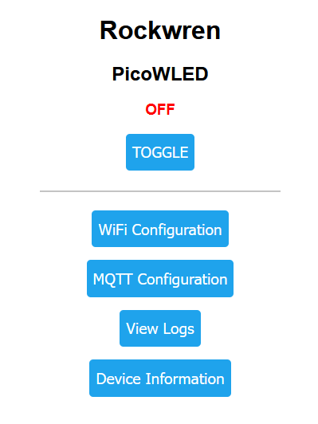
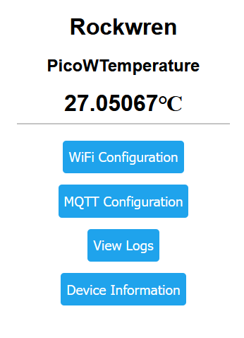
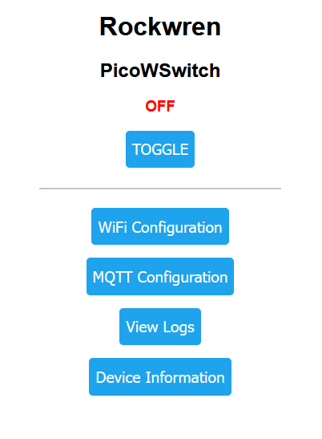

<!--
SPDX-FileCopyrightText: 2023 Charles Crighton <code@crighton.net.nz>

SPDX-License-Identifier: CC-BY-4.0
-->

# Rockwren Examples

- [Pico LED Light](#pico-led-light)
- [Pico Binary Sensor](#pico-binary-sensor)
- [Pico Switch](#pico-switch)

## Pico LED Light

Control the onboard LED of a Pico W.

Source: [pico_led_light](/examples/pico_led_light)

## Pico Binary Sensor

Pico W binary sensor for door position based on switch on pin 22.

Source: [pico_binary_sensor](/examples/pico_binary_sensor)

## Pico Temperature Sensor

Pico W sensor that reports reads the onboard temperature.

Source: [pico_temperature](/examples/pico_temperature)

## Pico Switch

Pico W switch on pin 22.

Source: [pico_switch](/examples/pico_switch)

## ESP8266 LED Light

Similar to the Pico W LED light but for the ESP8266 that has the led control on pin 2.

Note that this example must be used with the ESP8266 firmware build that has the Rockwren package and it's
dependencies as frozen modules to reduce resource consumption.  See the [installation](install.md) instructions
for details on flashing the ESP8266 firmware.

Source: [esp8266_led_light](../examples/esp8266_led_light)
