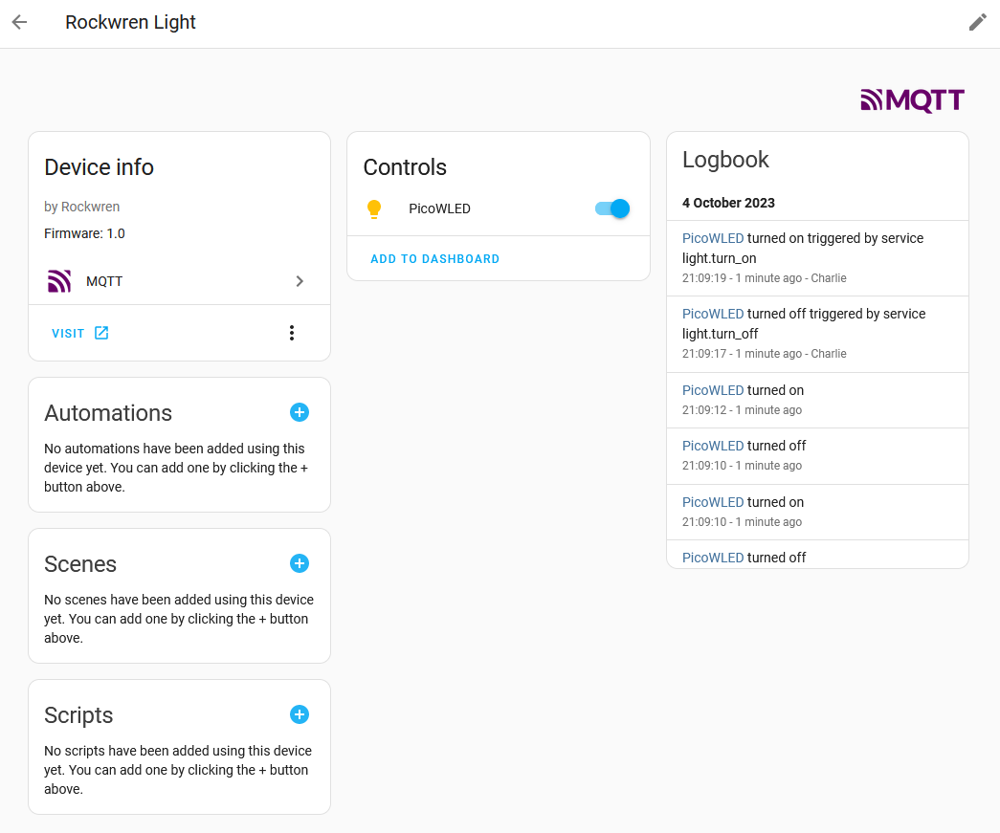

<!--
SPDX-FileCopyrightText: 2023 Charles Crighton <code@crighton.net.nz>

SPDX-License-Identifier: CC-BY-4.0
-->

# Rockwren Home Assistant Discovery

[Home Assistant](https://www.home-assistant.io/) the open source home automation platform, supports
automatic discovery of devices that send discovery messages via MQTT.

A Rockwren device can send one or more discovery messages to home assistant.

Home Assistant has a [guide](https://www.home-assistant.io/integrations/mqtt/#mqtt-discovery) to MQTT discovery.

The ```mqtt_client``` Device instance attribute provides a device_id attribute that is unique for the device.  Use this
in the discovery messages to ensure that related discovery message are associated with the same device.

## Rockwren API for Discovery

Rockwren supports an API for adding discovery messages.

To add discovery messages the device must override the ```rockwren.Device.discovery_function```
function.

```discovery_function()``` must returns an array of tuples (device_type, discovery_json).

## Examples

- [Simple Light](#simple-light)
- [Binary Sensor](#binary-sensor)
- [Switch](#switch)
- [Sending Multiple Discovery messages](#multiple-discovery-messages)

### Simple Light

```python
def default_discovery():
    return [("light", {"unique_id": f"{self.mqtt_client.device_id}_light",
                       "name": self.mqtt_client.device.name,
                       "platform": "mqtt",
                       "schema": "json",
                       "state_topic": self.mqtt_client.state_topic,
                       "command_topic": self.mqtt_client.command_topic,
                       "payload_on": "ON",
                       "payload_off": "OFF",
                       "availability": {
                           "topic": self.mqtt_client.availability_topic
                       },
                       "device": {
                           "identifiers": [self.mqtt_client.device_id],
                           "name": f"Rockwren Light",
                           "sw_version": "1.0",
                           "model": "",
                           "manufacturer": "Rockwren",
                           "configuration_url": f"http://{self.mqtt_client.connection_params['ip_address']}/"
                       }
                       })]
```

### Binary Sensor

[Home Assistant MQTT Binary Sensor](https://www.home-assistant.io/integrations/binary_sensor.mqtt/).

Many device classes are provided.  The example below uses the

```python
def discovery_function(self):
    return [("binary_sensor", {"unique_id": f"{self.mqtt_client.device_id}_door",
                               "name": "Rockwren Pico W Door Position Binary Sensor",
                               "device_class": "door",
                               "state_topic": self.mqtt_client.state_topic,
                               "availability": {
                                   "topic": self.mqtt_client.availability_topic
                               },
                               "device": {
                                   "identifiers": [self.mqtt_client.device_id],
                                   "name": f"Rockwren Pico W Door Sensor",
                                   "sw_version": "1.0.0",
                                   "model": "",
                                   "manufacturer": "Rockwren",
                                   "configuration_url": f"http://{self.mqtt_client.connection_params['ip_address']}/"
                               }
                               })]
```

### Switch

Discovery message from the [pico_switch](/examples/pico_switch/main.py) example.

```python
def discovery_function(self):

    return [("switch", {"unique_id": f"{self.mqtt_client.device_id}_switch",
                        "name": "Rockwren Pico W Switch",
                        "platform": "mqtt",
                        "state_topic": self.mqtt_client.state_topic,
                        "command_topic": self.mqtt_client.command_topic,
                        "payload_on": '{"state": "ON"}',
                        "payload_off": '{"state": "OFF"}',
                        "availability": {
                            "topic": self.mqtt_client.availability_topic
                        },
                        "device": {
                            "identifiers": [self.mqtt_client.device_id],
                            "name": f"Rockwren Pico W Switch",
                            "sw_version": "0.1",
                            "model": "",
                            "manufacturer": "Rockwren",
                            "configuration_url": f"http://{self.mqtt_client.connection_params['ip_address']}/"
                        }
                        })]
```


### Multiple Discovery Messages

The following example is for a garage door opener that provides a momentary action switch and a door position sensor.

For button configuration for door activation see the [button](https://www.home-assistant.io/integrations/button/)
integration.

For the binary_sensor for the garage door position see the
[binary_sensor](https://www.home-assistant.io/integrations/binary_sensor/) integration.

```python
def discovery_function(self):
    return [("button", {"unique_id": f"{self.mqtt_client.device_id}_button",
                        "automation_type": "trigger",
                        "type": "button_short_press",
                        "subtype": "button_1",
                        "name": "Garage Door Button",
                        "state_topic": self.mqtt_client.state_topic,
                        "command_topic": self.mqtt_client.command_topic,
                        "availability": {
                            "topic": self.mqtt_client.availability_topic,
                        },
                        "device": {
                            "identifiers": [self.mqtt_client.device_id],
                            "name": f"Garage Door Controller",
                            "sw_version": "Garage Door Controller 1.0.0",
                            "model": "Garage Door Controller",
                            "manufacturer": "Rockwren",
                            "configuration_url": f"http://{self.mqtt_client.connection_params['ip_address']}/"
                        }}
             ),
            ("binary_sensor", {"unique_id": f"{self.mqtt_client.device_id}_position",
                               "name": "Garage Door Position",
                               "state_topic": self.mqtt_client.state_topic,
                               "device_class": "garage_door",
                               "payload_on": "open",
                               "payload_off": "closed",
                               "value_template": "{{ value_json.state}}",
                               "availability": {
                                   "topic": self.mqtt_client.availability_topic
                               },
                               "device": {
                                   "identifiers": [self.mqtt_client.device_id],
                                   "name": "Garage Door Controller",
                               }
                               }
             )]
```

### Example Device in Home Assistant


